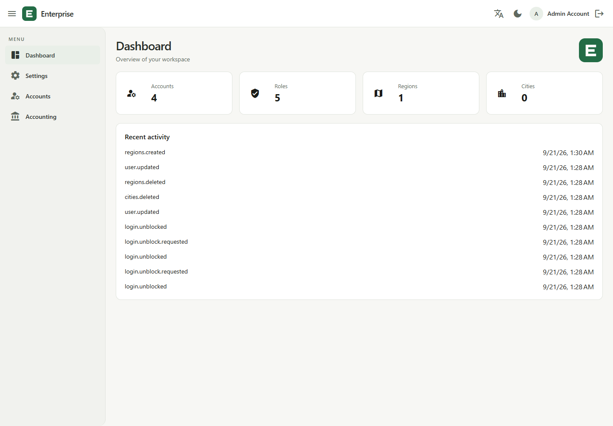
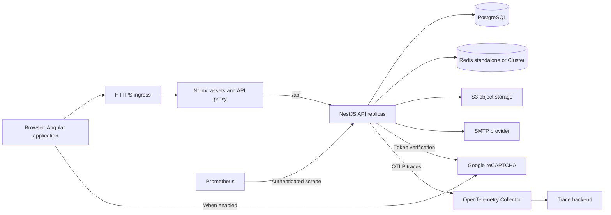
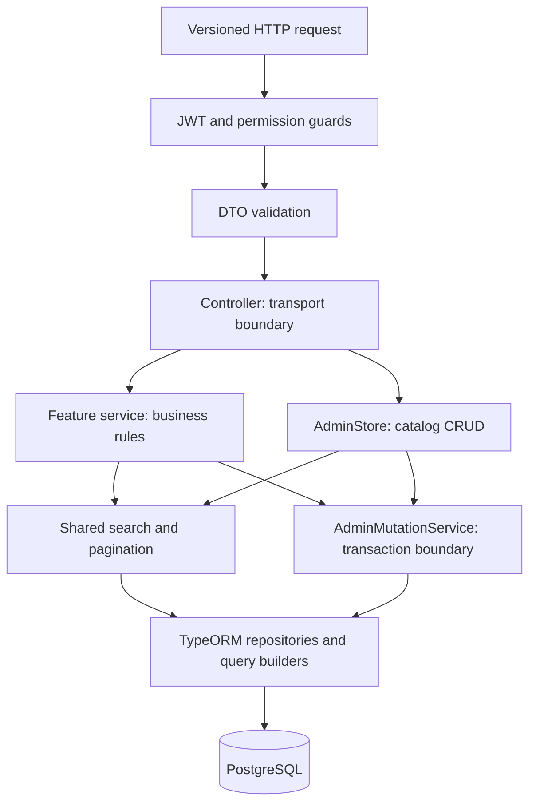
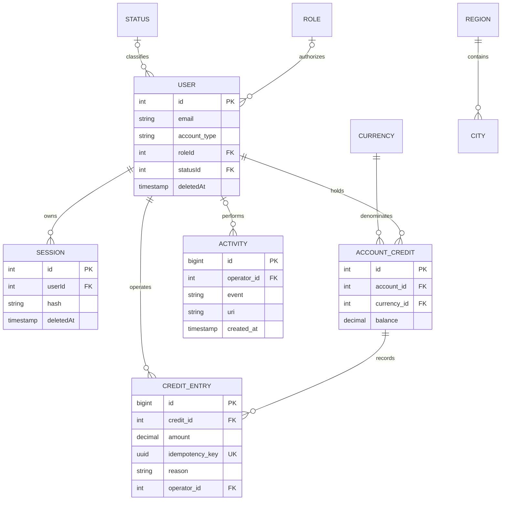
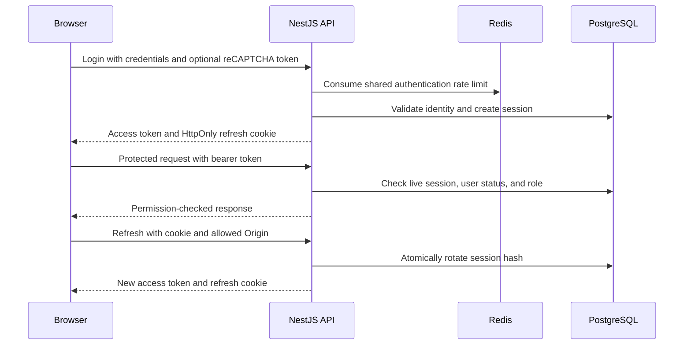

# Enterprise Angular & NestJS Monorepo Boilerplate

**A full-stack Boilerplate TypeScript foundation for enterprise web applications, administration platforms, and internal business tools.**

Build with **Angular 22**, **NestJS 11**, **PostgreSQL**, **TypeORM**, and **Redis** in one coordinated repository. Develop frontend and backend features together, deploy each application independently, and reuse established patterns for authentication, role-based access control, transactional business operations, testing, and observability.

The project includes a working administration application, Docker images, Kubernetes deployment manifests, and a Jenkins delivery pipeline. Its modular architecture gives teams a practical starting point for extending business capabilities while keeping security rules and data consistency explicit.

[Quick start](#quick-start) · [Architecture](#system-architecture) · [Capabilities](#enterprise-application-capabilities) · [Deployment](#docker-kubernetes-and-cicd) · [Documentation](#documentation)

## Why this enterprise application foundation?

| Team priority                       | What this repository provides                                                               |
| ----------------------------------- | ------------------------------------------------------------------------------------------- |
| Deliver complete business features  | Angular screens, NestJS endpoints, migrations, and integration tests in the same change     |
| Keep application rules maintainable | Feature modules, validated DTOs, typed catalog definitions, and shared backend helpers      |
| Control administrative access       | Server-enforced permissions, live session checks, and administrator safeguards              |
| Protect business data               | PostgreSQL transactions, decimal credit balances, idempotent adjustments, and audit history |
| Deploy independently                | Separate frontend/API images, lockfiles, processes, and scaling policies                    |
| Diagnose production behavior        | Structured logs, request IDs, distributed traces, metrics, and health probes                |
| Establish repeatable delivery       | Quality gates, database/browser tests, image scanning, SBOMs, and reviewed releases         |
| Support multilingual administration | English/Arabic navigation, responsive Material interfaces, and light/dark themes            |

Suitable starting points include customer administration portals, operations dashboards, reference-data management applications, and account-credit workflows. Teams can add domain-specific modules without first building the surrounding identity, administration, and delivery infrastructure.

## Contents

- [Application preview and evidence](#application-preview-and-evidence)
- [Enterprise application capabilities](#enterprise-application-capabilities)
- [Technology stack](#technology-stack)
- [System architecture](#system-architecture)
- [Backend architecture and DRY design](#backend-architecture-and-dry-design)
- [Frontend architecture](#frontend-architecture)
- [Data architecture and consistency](#data-architecture-and-consistency)
- [Authentication and authorization](#authentication-and-authorization)
- [Repository structure](#repository-structure)
- [Quick start](#quick-start)
- [Configuration](#configuration)
- [API conventions](#api-conventions)
- [Testing and quality gates](#testing-and-quality-gates)
- [Docker, Kubernetes, and CI/CD](#docker-kubernetes-and-cicd)
- [Observability and operations](#observability-and-operations)
- [Scaling and extension strategy](#scaling-and-extension-strategy)
- [Documentation](#documentation)
- [Frequently asked questions](#frequently-asked-questions)

## Application preview and evidence



Explore the [desktop/mobile screenshots, demo walkthrough, and measured local smoke workload](docs/demo-and-evidence.md). The evidence uses synthetic integration fixtures and includes reproduction steps and measurement limitations.

## Enterprise application capabilities

| Area                       | Implemented capabilities                                                                                                           |
| -------------------------- | ---------------------------------------------------------------------------------------------------------------------------------- |
| Identity                   | Login, registration, email confirmation/resend, password recovery/reset, profile updates, refresh sessions, and logout             |
| Access control             | Built-in administrator/user roles, configurable resource permissions, API guards, and permission-aware navigation                  |
| Account administration     | Users/customers, status changes, role assignment, soft deletion, session revocation, and last-administrator protection             |
| Business catalogs          | Regions, cities, currencies, roles, and application display settings                                                               |
| Account credits            | Per-account currency balances, positive/negative adjustments, exact decimal arithmetic, UUID idempotency, and an adjustment ledger |
| Operational administration | Dashboard summaries, activity history, login-block visibility/unblocking, and targeted cache invalidation                          |
| Files and email            | Local development storage, S3 and presigned-upload drivers, SMTP templates, and MailDev                                            |
| Abuse protection           | Shared Redis authentication limits and configurable Google reCAPTCHA v3 verification                                               |
| Operations                 | Logs, traces, metrics, readiness checks, container builds, deployment manifests, and release tooling                               |

Credit accounting covers balances and adjustments. Double-entry accounting, invoicing, payroll, and payment processing require additional domain modules. Tenant isolation and enterprise SSO are also extension work; they are not implied by the enterprise positioning of this foundation.

## Technology stack

| Layer                | Technology                                           | Responsibility                                                 |
| -------------------- | ---------------------------------------------------- | -------------------------------------------------------------- |
| Frontend             | Angular 22, TypeScript, RxJS, Angular Material/CDK   | Application shell, routes, forms, tables, and interactions     |
| Localization         | Transloco and Arabic font assets                     | Language selection and localized navigation                    |
| Backend              | NestJS 11 and TypeScript                             | Modular APIs, validation, authorization, and services          |
| Persistence          | TypeORM and PostgreSQL                               | Entities, queries, transactions, migrations, and durable state |
| Shared runtime state | Redis standalone or Redis Cluster                    | Authentication rate counters and short-lived cache             |
| Identity             | Passport, JWT, bcrypt                                | Authentication, refresh-session rotation, and password hashing |
| Object storage       | Local driver or Amazon S3                            | File persistence and optional presigned uploads                |
| Email                | Nodemailer and SMTP                                  | Confirmation and password recovery messages                    |
| Telemetry            | Pino, OpenTelemetry, Prometheus                      | Structured logs, traces, and operational metrics               |
| Verification         | Jest, Jasmine/Karma, Playwright, integration scripts | Backend/browser units and real dependency tests                |
| Delivery             | Docker, Nginx, Kubernetes/Kustomize, Jenkins         | Artifacts, routing, orchestration, and releases                |

Exact dependencies are maintained in the [API manifest](apps/api/package.json), [web manifest](apps/web/package.json), and their lockfiles. Local Compose supplies PostgreSQL 17, Redis 7.4, and MailDev.

## System architecture

The backend is a **modular monolith**: feature modules share one API process and transactional database. Angular is a separate deployment. This keeps business transactions straightforward while allowing frontend and API releases and replica counts to evolve independently.



**Request path:** the browser loads Angular assets from Nginx and calls the API through the same public origin. Nginx forwards `/api` to the internal API Service. PostgreSQL owns durable state; Redis shares rate counters and cache across replicas. Production files use external object storage.

In local development, Angular's development server provides the API proxy. Compose runs the database, Redis, and mail service; root npm commands run the application development servers.

### Architectural boundaries

- **One repository, two deployable applications.** Separate lockfiles accommodate different TypeScript and tooling requirements.
- **Explicit feature ownership.** Identity, administration, geography, accounting, settings, files, and platform concerns have defined module boundaries.
- **Shared infrastructure, domain-specific rules.** Query and transaction behavior is reused; account safeguards and credit invariants stay in dedicated services.
- **Externalized shared state.** Database sessions, Redis, and production object storage support multiple API replicas.

## Backend architecture and DRY design



Controllers define routes, DTOs, and permissions. Services coordinate business behavior. Repositories, entities, and query builders handle persistence. Identity/session features also use repository interfaces and mappers to separate domain objects from stored entities.

### Shared components

| Component                     | Responsibility                                                                               | Source                                                                        |
| ----------------------------- | -------------------------------------------------------------------------------------------- | ----------------------------------------------------------------------------- |
| `AdminController`             | Apply versioning, JWT authentication, and permission guards consistently                     | [Decorator](apps/api/src/admin/admin-controller.decorator.ts)                 |
| `catalog-resources`           | Define catalog entities, public/searchable fields, and audit prefixes once                   | [Typed definitions](apps/api/src/admin/catalog-resources.ts)                  |
| `AdminStore`                  | Reuse allowlisted catalog listing, lookup, creation, update, and deletion                    | [Catalog persistence](apps/api/src/admin/admin-store.service.ts)              |
| `applySearch` / `paginateRaw` | Share literal search, parameter binding, allowed sorting, pagination, and response envelopes | [Query helpers](apps/api/src/admin/admin-query.ts)                            |
| `AdminMutationService`        | Coordinate transactions, audit writes, and database-error translation                        | [Mutation boundary](apps/api/src/admin/admin-mutation.service.ts)             |
| `hashPassword`                | Share bcrypt work factor and UTF-8 byte limits while preserving caller-specific errors       | [Password policy](apps/api/src/utils/password.ts)                             |
| `revokeUserSessions`          | Revoke sessions through the caller's transaction manager, with optional session exclusion    | [Revocation helper](apps/api/src/session/persistence/revoke-user-sessions.ts) |

The pagination helper expects one result row per root entity; aggregate to-many joins before using it. Administrative writes obtain repositories from the transaction manager so data changes, session revocation, and audit records can commit or roll back together.

### Backend module map

| Module              | Ownership                                                                               |
| ------------------- | --------------------------------------------------------------------------------------- |
| `auth`              | Login, confirmation/reset flows, access tokens, and browser refresh cookies             |
| `users` / `session` | Identity persistence, domain mapping, profiles, and session lifecycle                   |
| `admin`             | Users/customers/roles, permissions, catalog queries, and audited mutations              |
| `geography`         | Region and city administration                                                          |
| `accounting`        | Currencies, credit balances, and adjustment invariants                                  |
| `settings`          | Display settings, dashboard, activities, login-block administration, and cache controls |
| `files` / `mail`    | Storage drivers and transactional account email                                         |
| `platform`          | Runtime configuration, Redis, throttling, and reCAPTCHA                                 |
| `observability`     | Metrics, health endpoints, logs, and telemetry lifecycle                                |
| `database`          | Connections, migrations, migration locking, and account seeding                         |

## Frontend architecture

Angular uses standalone components, lazy feature routes, strict TypeScript, signals for local state, and RxJS for asynchronous flows.

- **`core/`** contains authentication, HTTP interceptors, guards, theme/language support, navigation, and application-wide services.
- **`features/`** contains domain screens, feature routes, forms, and request payloads.
- **`shared/`** contains reusable components and CRUD composition helpers.
- **Material/CDK** supplies interface primitives; shared helpers coordinate dialogs, pagination, feedback, and unsaved changes.
- **Navigation guards** improve the user experience; API guards independently enforce authorization.

Access tokens stay in memory. An HttpOnly refresh cookie supports recovery after reload. Theme/language preferences can persist locally without storing authentication tokens in localStorage. See the [frontend guide](apps/web/README.md).

## Data architecture and consistency

This diagram summarizes core relationships. Migrations and entities remain the source of truth for full columns, nullability, constraints, and indexes.



Display settings and login blocks are additional operational tables. File metadata supports user-file relationships. Roles store allowlisted resource/action permissions; account type distinguishes users from customers.

### Credit adjustment guarantees

1. A request supplies the account, currency, decimal amount string, reason, and UUID idempotency key.
2. A transaction finds or creates the unique account/currency balance row.
3. An insert claims the ledger's unique UUID before changing the balance. PostgreSQL coordinates concurrent claims across replicas.
4. An atomic database increment updates the balance. The ledger entry, balance change, and audit event commit together.
5. A matching retry returns `replayed: true` without applying the amount again. Conflicting reuse returns `409`.

Amounts use PostgreSQL `numeric(20,4)` and remain strings at the API boundary to preserve precision. A replay returns the **current balance**, which may include later adjustments. Ledger entries are append-only through the API; corrections use new compensating adjustments.

### Account and schema safeguards

Administrative account mutations lock the built-in administrator role row before locking the target account. This serializes competing changes and protects the last active administrator. Self-disable, self-delete, and self-role-change protections are explicit service rules.

User/session soft deletion preserves lifecycle history. Migrations manage schema evolution; production schema synchronization is disabled. The migration runner uses a separate PostgreSQL advisory lock to prevent simultaneous migrators.

## Authentication and authorization



- Production browser cookies use `Secure`, `HttpOnly`, `SameSite=Strict`, and the `__Host-refresh` name.
- Browser login, refresh, and logout require an exact allowlisted Origin.
- JWT validation reads live database state, so revocation and role/status changes affect subsequent requests.
- Reusing an old refresh token fails after rotation.
- Registration requires email confirmation; confirmation/reset signatures are tied to account state.
- Password hashing uses bcrypt with a shared work factor of `12` and a `72`-byte UTF-8 limit.
- Role `1` is the built-in administrator. Role `2` has no administrative permissions by default. Delegated roles use resource/action permissions; writes imply reads for that resource.
- User and role administration remain restricted to built-in administrators.
- Production authentication limits use shared Redis. Optional reCAPTCHA verifies action, hostname, token age, and score on the server.

Read the [API and security contracts](docs/api-and-security.md) for complete authentication flows and operational safeguards.

## Repository structure

```text
enterprise-monorepo/
├── apps/
│   ├── api/
│   │   ├── src/
│   │   │   ├── admin/              # Shared patterns and account management
│   │   │   ├── accounting/         # Currencies, balances, adjustment ledger
│   │   │   ├── auth/               # Authentication and token strategies
│   │   │   ├── database/           # Migrations, configuration, seeds
│   │   │   ├── geography/          # Regions and cities
│   │   │   ├── platform/           # Redis, throttling, reCAPTCHA
│   │   │   ├── settings/           # Operational administration
│   │   │   ├── observability/      # Health, metrics, telemetry
│   │   │   └── users/, session/, files/, mail/, roles/, statuses/, utils/
│   │   ├── .env.example
│   │   └── Dockerfile
│   └── web/
│       ├── src/app/
│       │   ├── core/               # Application-wide services and guards
│       │   ├── features/           # Business screens and routes
│       │   └── shared/             # Components and CRUD helpers
│       ├── nginx.conf
│       └── Dockerfile
├── deploy/
│   ├── kubernetes/                 # Base, production overlay, collector
│   └── observability/              # Prometheus, alerts, collector config
├── docs/                           # Architecture, security, deployment, operations
├── tools/                          # Tasks, integration, release, load checks
├── compose.yaml                    # Local PostgreSQL, Redis, MailDev
├── Jenkinsfile                     # Verification and optional production release
└── package.json                    # Root developer commands
```

## Quick start

### Prerequisites

- Node.js **24.15+ within 24.x**, or **26.x**, and npm.
- Docker with Docker Compose.
- Chrome/Chromium for browser unit tests; Playwright browser dependencies for end-to-end tests.

Run commands from the repository root unless a step specifies another directory.

### 1. Install dependencies and start infrastructure

```sh
npm run bootstrap
npm run infra:up
```

Bootstrap installs each application's locked dependencies. Compose starts PostgreSQL, Redis, and MailDev.

### 2. Configure the API

Copy [apps/api/.env.example](apps/api/.env.example) to `apps/api/.env` if no local configuration exists. In PowerShell:

```powershell
if (-not (Test-Path apps/api/.env)) {
    Copy-Item apps/api/.env.example apps/api/.env
}
```

Set four **different** random authentication secrets and provide `SEED_ADMIN_EMAIL` and `SEED_ADMIN_PASSWORD`. Use a seed password of at least 12 characters within the bcrypt 72-byte limit. Keep `.env` outside version control.

Generate one secret at a time, repeating for each signing key:

```sh
node -e "console.log(require('node:crypto').randomBytes(32).toString('hex'))"
```

The example file matches the local Compose database, Redis, and SMTP ports. Production credentials and TLS settings require separate configuration.

### 3. Apply migrations and seed reference data

```sh
cd apps/api
npm run migration:run
npm run seed
cd ../..
```

Seeds create configured accounts only when they do not exist. Existing accounts/passwords are preserved. Seed accounts are active immediately; self-registered accounts require email confirmation.

### 4. Start both applications

```sh
npm run dev
```

| Local service            | Address                                                           |
| ------------------------ | ----------------------------------------------------------------- |
| Angular application      | [localhost:4200](http://localhost:4200)                           |
| API base path            | [localhost:3001/api/v1](http://localhost:3001/api/v1)             |
| Swagger UI, when enabled | [localhost:3001/docs](http://localhost:3001/docs)                 |
| MailDev inbox            | [localhost:51080](http://localhost:51080)                         |
| API readiness            | [localhost:3001/health/ready](http://localhost:3001/health/ready) |

Angular proxies `/api` to port `3001`; set `API_PROXY_TARGET` for another address. Stop infrastructure with `npm run infra:down`; Compose preserves local data volumes.

## Configuration

[The environment example](apps/api/.env.example) documents available settings. Configuration is validated at startup.

| Concern          | Principal environment variables                                                                                  |
| ---------------- | ---------------------------------------------------------------------------------------------------------------- |
| Application      | `APP_PORT`, `API_PREFIX`, `FRONTEND_DOMAIN`, `BACKEND_DOMAIN`, `APP_CORS_ORIGINS`                                |
| Database         | `DATABASE_URL` or individual connection fields, `DATABASE_MAX_CONNECTIONS`, TLS/CA settings                      |
| Authentication   | Four `AUTH_*_SECRET` values and token expiry settings                                                            |
| Redis/throttling | `REDIS_MODE`, `REDIS_URL`, `REDIS_CLUSTER_NODES`, credentials/TLS, `AUTH_RATE_LIMIT`, `AUTH_RATE_WINDOW_SECONDS` |
| reCAPTCHA        | `RECAPTCHA_ENABLED`, site/secret keys, allowed hostnames, minimum score                                          |
| Storage          | `FILE_DRIVER`, `AWS_S3_REGION`, `AWS_DEFAULT_S3_BUCKET`, optional static credentials                             |
| Email            | `MAIL_HOST`, `MAIL_PORT`, authentication/TLS, sender identity                                                    |
| Operations       | `TRUST_PROXY`, `METRICS_TOKEN`, `LOG_LEVEL`, `SWAGGER_ENABLED`, `OTEL_ENABLED`, OTLP endpoint/sampling           |
| Seeding          | `SEED_ADMIN_EMAIL`, `SEED_ADMIN_PASSWORD`, optional user equivalents                                             |

Production uses shared Redis, verified dependency TLS, external object storage, exact trusted-proxy/origin settings, and externally supplied secrets. S3 supports the AWS default credential chain for workload identity. See the [deployment guide](docs/deployment.md) for provisioning details.

## API conventions

| Route group                     | Purpose                                                                                   |
| ------------------------------- | ----------------------------------------------------------------------------------------- |
| `/api/v1/auth/browser`          | Browser login, refresh, logout, and public authentication configuration                   |
| `/api/v1/auth`                  | Registration, confirmation, profile, recovery, and native token flows                     |
| `/api/v1/admin`                 | Accounts, roles, geography, currencies, credits, settings, and operational administration |
| `/api/v1/users`                 | Legacy administrator reads; administrative writes use `/admin/users`                      |
| `/health/live`, `/health/ready` | API liveness and dependency readiness                                                     |
| `/metrics`                      | Metrics; bearer token required in production                                              |

Admin lists accept `page`, `page_size`, `order_by`, `direction`, and `search`. Default page size is `25`, maximum is `100`, and maximum search length is `200`. Sort fields are allowlisted. List responses use:

```json
{
  "data": {
    "list": [],
    "count": 0
  }
}
```

Validation normally returns `422`; business-rule violations return `400`; conflicting/referenced records return `409`; missing records return `404`. Most administrative deletes return `204`.

Example body for `POST /api/v1/admin/account-credits/adjustments`:

```json
{
  "account_id": 12,
  "currency_id": 1,
  "amount": "25.5000",
  "reason": "Approved account credit",
  "idempotency_key": "a8f39bf0-8ac4-4de4-af70-ad0d6765e1a2"
}
```

Use existing account/currency IDs. Retry an uncertain request with the same payload and UUID; generate a new key for a new business adjustment.

## Testing and quality gates

| Root command                    | Purpose                                                                    |
| ------------------------------- | -------------------------------------------------------------------------- |
| `npm run bootstrap`             | Install both applications from their lockfiles                             |
| `npm run dev`                   | Start both development servers                                             |
| `npm run build`                 | Build API and production frontend                                          |
| `npm run typecheck`             | Check both applications' TypeScript                                        |
| `npm test`                      | Run backend and frontend unit suites                                       |
| `npm run check`                 | Formatting, lint, application checks/tests, builds, and dependency audits  |
| `npm run integration`           | Test live API flows with PostgreSQL, Redis, SMTP, and a temporary database |
| `node tools/ci-integration.mjs` | Start disposable dependencies and run API plus Playwright tests            |
| `npm run test:cluster`          | Check the Redis adapter against a disposable six-node cluster              |

Build the API before integration tooling, which executes `apps/api/dist` files. Start local Compose for the ordinary integration command; the CI wrapper provisions its own dependencies. Cluster checks expect `enterprise-api:verification`, or a built image selected with `API_IMAGE`.

Coverage includes authentication/revocation, permissions, catalog/account CRUD, last-administrator concurrency, credit idempotency/precision, login-block operations, email confirmation/reset, readiness, metrics, and OTLP export. Browser tests exercise journeys against the real API.

The integration harness creates and removes a generated test database. Override dependency ports with `TEST_DATABASE_PORT`, `TEST_REDIS_PORT`, `TEST_MAIL_PORT`, and `TEST_MAIL_UI_PORT`. See [API integration](tools/integration.mjs) and [CI integration](tools/ci-integration.mjs) for executable workflows.

## Docker, Kubernetes, and CI/CD

### Container builds

```sh
docker build -t enterprise-api:local apps/api
docker build -t enterprise-web:local apps/web
kubectl kustomize deploy/kubernetes/overlays/production
```

The API image runs NestJS on port `3001`. The frontend serves Angular through nonroot Nginx on port `8080`, with SPA fallback, asset caching, security headers, and API proxying. Kustomize renders manifests for inspection; this command does not deploy them.

### Kubernetes deployment architecture

Manifests include separate API/web Deployments and Services, production ingress, ConfigMap/Secret references, a migration Job template, network policies, disruption budgets, autoscalers, and an OpenTelemetry Collector.

- Pods use nonroot users, read-only root filesystems, dropped capabilities, resource limits, and health probes.
- Rolling deployments check readiness before routing traffic to replacement pods.
- Default API autoscaling is `2–20` replicas; web autoscaling is `2–10`. These are configurable policies, not measured capacity guarantees.
- Production expects externally provisioned PostgreSQL, Redis, object storage, SMTP, TLS, and telemetry.
- Network, ingress, workload identity, registry, and secrets must match the target environment.

### Jenkins release workflow

| Stage                       | Outcome                                                                            |
| --------------------------- | ---------------------------------------------------------------------------------- |
| Checkout/preflight          | Validate CI tooling and identify the release commit                                |
| Locked installation         | Install application dependencies reproducibly                                      |
| Parallel quality gates      | Lint, formatting, tests, builds, and dependency audits                             |
| Integration/browser checks  | Verify complete flows with disposable dependencies                                 |
| Image/manifest verification | Scan images, generate CycloneDX SBOMs, validate manifests, and check Redis Cluster |
| Optional publication        | Publish trusted main-branch images and capture immutable registry digests          |
| Release review              | Archive rendered manifests and request production approval                         |
| Controlled deployment       | Acquire release lock, run migrations, roll out applications, and check health      |

Publication and deployment are disabled by default. Jenkins needs the tools and scoped credentials in the [deployment guide](docs/deployment.md). Use backward-compatible expand/contract migrations; application rollback does not automatically reverse database changes.

## Observability and operations

| Signal        | Operator visibility                                         |
| ------------- | ----------------------------------------------------------- |
| JSON logs     | Request ID, method, status, duration, and trace correlation |
| OpenTelemetry | HTTP, Express, and PostgreSQL timing exported through OTLP  |
| Prometheus    | Request throughput/latency and process behavior             |
| API liveness  | Whether the API process responds                            |
| API readiness | PostgreSQL connectivity and Redis availability when enabled |
| Audit history | Actor, event, object identifier, and timestamp              |

API readiness runs on the API workload. Nginx `/health/live` checks the web server independently. Scrape metrics through the internal API metrics Service rather than the public frontend proxy.

Scrape configuration, alerts, and collector configuration are under [deploy/observability](deploy/observability) and [Kubernetes observability](deploy/kubernetes/observability). Define retention, backup/PITR, restore exercises, alert routing, and incident ownership for the deployed environment. The [operations guide](docs/operations.md) includes dashboard queries and incident procedures.

## Scaling and extension strategy

### Capacity planning

The default database pool is `10` connections per API replica. At the HPA maximum of `20` API replicas, plan for up to `200` application connections, plus deployment surge, migrations, and operational headroom.

Statements have a five-second timeout. Administrative pagination is bounded; catalog lookups cap at `1,000` options. Measure offset pagination, substring search, and dashboard counts against representative volumes. Introduce keyset pagination, appropriate indexes/search models, or precomputed aggregates when justified by measurements.

[tools/load.js](tools/load.js) provides a k6 starting workload. Establish latency, throughput, availability, and recovery objectives through staging load tests, dependency-failure exercises, and restore verification.

### Adding a business feature

1. Define domain behavior, permissions, and the API contract.
2. Add entities and a reviewed database migration.
3. Implement a NestJS module with validated DTOs and thin controllers.
4. Reuse catalog/query helpers where appropriate; keep specialized invariants explicit.
5. Use the shared transaction boundary for audited administrative writes.
6. Add Angular feature routes/screens using shared form/list composition.
7. Add focused unit, API integration, and relevant browser coverage.
8. Update runtime configuration and operational documentation as needed.

Extract services when ownership, release cadence, reliability isolation, or measured scaling needs justify the boundary. Login unblocking uses a durable database retry record and idempotent Redis reset; other asynchronous workflows require an outbox/queue and idempotent workers; account email delivery is currently synchronous with bounded SMTP timeouts.

## Documentation

| Guide                                            | Contents                                                       |
| ------------------------------------------------ | -------------------------------------------------------------- |
| [Architecture and scaling](docs/architecture.md) | Boundaries, consistency, scaling limits, capacity verification |
| [API and security](docs/api-and-security.md)     | Authentication, permissions, reCAPTCHA, operational safeguards |
| [Deployment](docs/deployment.md)                 | Docker, Kubernetes, provisioning, Jenkins, rollouts            |
| [Operations](docs/operations.md)                 | Metrics, traces, dashboards, incidents, retention              |
| [Backend](apps/api/README.md)                    | NestJS structure, shared conventions, developer commands       |
| [Frontend](apps/web/README.md)                   | Angular architecture, sessions, proxying, verification         |

## Frequently asked questions

### Is this an Angular and NestJS enterprise starter?

Yes. It provides a working TypeScript administration application and supporting engineering patterns for enterprise web applications. Business-specific workflows and deployment requirements remain part of the adopting team's implementation.

### Can the frontend and backend deploy independently?

Yes. They have separate builds, lockfiles, Docker images, and Kubernetes workloads. The monorepo coordinates development without coupling runtime replica counts.

### Does it support role-based access control and audit logs?

Yes. API guards check current roles and sessions. Administrative business mutations write audit identifiers within database transactions. Permission-aware navigation complements server enforcement.

### Can it become a multi-tenant SaaS platform?

It can serve as a foundation, but tenant isolation is not implemented. A multi-tenant product needs explicit ownership, authorization boundaries, database/query isolation, and tests before tenant data is introduced.

### Is it ready for production adoption?

The repository includes deployment assets, security controls, observability, and automated verification. Adoption requires configuring infrastructure, secrets, domain/TLS, backups, and monitoring, then validating operational objectives. Compliance certifications, availability targets, and workload capacity are not established by repository features alone.

## Maintainer, license, and contribution

Maintained by **Ahmad Sadieh**. The repository is licensed under the [MIT License](LICENSE).

- [Contributing guide](CONTRIBUTING.md): development workflow and review expectations.
- [Security policy](SECURITY.md): private reporting to [saadyehahmmad@gmail.com](mailto:saadyehahmmad@gmail.com).
- [Code ownership](.github/CODEOWNERS): ownership email; GitHub account verification and repository write access are required.
- [Changelog](CHANGELOG.md) and [release guide](docs/releases.md): change tracking, validation, rollout, and recovery.

Repository administrators must enable branch protection and required review checks; documentation and CODEOWNERS alone do not enforce them.
