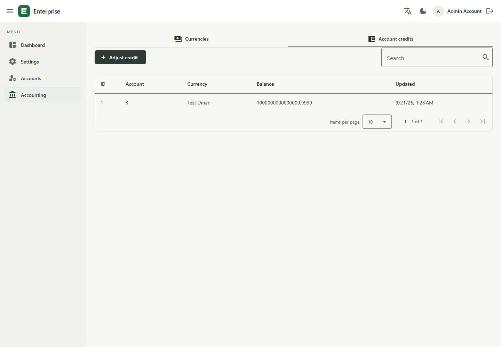
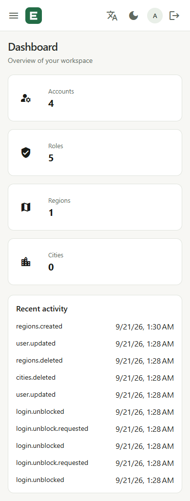

# Application demo and verification evidence

The screenshots below show the real Angular application connected to the NestJS API, PostgreSQL, and Redis with disposable integration fixtures. All accounts and balances are synthetic; the unusually large credit balance exercises exact decimal handling.

## Desktop dashboard

## Account credits

## Mobile dashboard

## Reproduce the demo

Use Node.js 24.15 or newer, installed dependencies, Docker, and Chrome. The API runner creates a random disposable database and applies migrations and seed data.

1. Run `npm run infra:up` and `npm --prefix apps/api run build`.
2. In PowerShell, run `$env:INTEGRATION_KEEP='true'; node tools/integration.mjs`. Wait for the passing result and browser-test readiness message. Credentials remain in ignored `.verification/browser-session.json`.
3. In a second terminal, set `$env:API_PROXY_TARGET='http://127.0.0.1:4301'`, then run `npm --prefix apps/web start -- --host 127.0.0.1 --port 4291`.
4. Run `npm --prefix apps/web run e2e` to exercise login, session recovery, every business route, persistent catalog CRUD, Arabic, theme switching, and mobile navigation.
5. Run `node tools/demo-evidence.mjs` to capture screenshots and the bounded local workload. Review images before publication. Do not run tests concurrently with measurement.
6. Stop the API runner and frontend with Ctrl+C. The integration runner drops only its own disposable database. Use `npm run infra:down` when finished with local dependencies.

For a manual walkthrough, sign in with the temporary credentials, inspect dashboard counts, create a region and city, inspect account permissions, and open Accounting → Account credits. Changes in this environment affect synthetic fixtures only.

## Measured local smoke workload

Captured at **2026-09-20T22:32:41.143Z** on Node.js **v24.15.0**, Windows x64, Intel(R) Core(TM) Ultra 7 155H, 22 logical CPUs, 15.3 GiB RAM. PostgreSQL and Redis ran in local Docker containers; the client and API shared the host, with API telemetry enabled.

| Measurement             | Observed value                                      |
| ----------------------- | --------------------------------------------------- |
| Endpoint                | `/api/v1/admin/account-credits?page=1&page_size=25` |
| Fixture records         | 1                                                   |
| Concurrent clients      | 5                                                   |
| Warmup requests         | 10                                                  |
| Measured duration       | 10074 ms                                            |
| Requests / errors       | 743 / 0                                             |
| Throughput              | 73.76 requests/second                               |
| Latency p50 / p95 / p99 | 64.16 / 108.38 / 278.76 ms                          |

[Raw measurement and source fingerprints](evidence/local-smoke.json) identify the measured working tree inputs. This ten-second, one-record read workload verifies local execution only. It does not establish production throughput, large-dataset latency, availability, or an SLA. Use [the staging workload](../tools/load.js) and [capacity guidance](architecture.md#capacity-verification) for representative validation.
