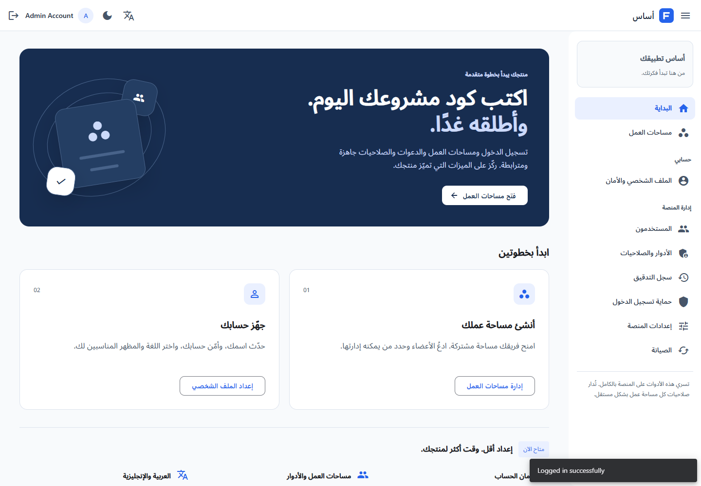
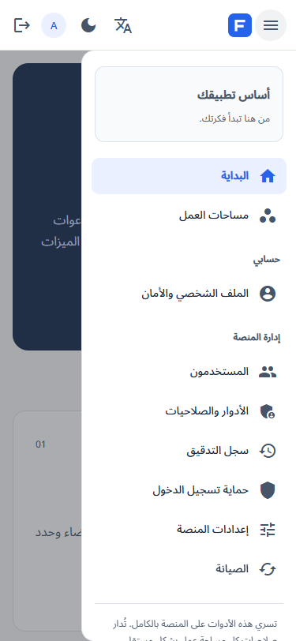

# SaaS Foundation

Build your business today. Start from an application foundation you can deploy and extend.

This is an Angular/NestJS SaaS starter, with PostgreSQL and optional Redis. The default product has no customer ledger, accounting workflow, or geographic catalog. Business features belong in your own modules.

## Product structure

| Surface | Purpose | Audience |
| --- | --- | --- |
| `/start` | A useful first-run page, without invented revenue or usage metrics | Signed-in users |
| `/workspaces` | Create and switch organization workspaces | Signed-in users |
| `/workspaces/:id` | Members, roles, invitation links, and workspace name | That workspace's members |
| `/join#token=…` | Explicit invitation acceptance | Matching verified account |
| `/profile` | Personal details, password, language, and appearance | Current user |
| `/admin/*` | Users, global roles, audit history, access protection, configuration, and maintenance | Platform permissions |

Old `/dashboard`, `/accounts/users`, `/accounts/roles`, and the core `/settings/*` links redirect to their replacements. The domain-specific sections are no longer routed in the default app.

## What ships and what requires a product decision

| Capability | Status |
| --- | --- |
| Email/password authentication, email verification, password reset | Implemented |
| Session recovery and revocation | Implemented; refresh credentials use HttpOnly cookies |
| Organization workspaces and role-scoped membership | Implemented |
| Invitations | Implemented as private, email-bound, single-use links; seven-day expiry |
| Invitation email delivery | Not automatic; the UI explicitly says to share the private link |
| Profile and password changes | Implemented; changing a password revokes other sessions |
| Platform administration, audit log, security controls | Implemented; separate from workspace roles |
| Arabic/English, RTL/LTR, responsive navigation, dark/light modes | Implemented |
| File storage, transactional authentication email, health/metrics/tracing | Existing integrations retained |
| Subscription checkout, billing portal, webhook reconciliation | Not implemented; select a provider for your product |
| Product usage quotas, entitlements, SSO, custom domains | Product extensions, not simulated features |
| Docker/Kubernetes/CI | Existing deployment tooling; configure secrets, domains, TLS, backups, and delivery before release |

The product structure was informed by [supastarter](https://supastarter.dev/saas-boilerplate), [next-forge's app](https://www.next-forge.com/docs/apps/app), [next-forge payments](https://www.next-forge.com/docs/packages/payments), and [SaaS Starter](https://saasstarter.work/). Their recurring baseline is identity, teams, authorization, localization, billing, and deployment support. A starter's feature list is not a substitute for verifying your deployment.

## Two separate authorization boundaries

Platform roles answer: “Who operates this installation?” Workspace roles answer: “Who belongs to this customer's organization?” Never map a workspace owner to the global administrator role.

* **Owner:** rename the workspace, manage all memberships, appoint another owner, and invite administrators or members.
* **Administrator:** rename the workspace, invite/remove members, revoke member invitations. Cannot appoint owners or administrators.
* **Member:** inspect the member directory and leave. Cannot inspect pending invitations or change other memberships.

Every workspace request checks membership on the server. Global administrator privileges do not bypass this boundary. Workspace mutations lock the workspace row to serialize concurrent role changes and invitation consumption. The last active owner cannot leave, be demoted, be suspended, or be deleted without another active owner. Cross-workspace identifiers are rejected.

Invitation tokens contain 256 random bits and are stored as SHA-256 hashes. The raw token is returned once for sharing, never listed by the member-directory endpoint, and placed in a URL fragment. Reissuing revokes the old token. Acceptance checks expiry, revocation, prior use, and the current active user's email; an existing membership is never upgraded by replaying an invitation. Creation is limited to 20 owned workspaces per user and 100 active pending invitations per workspace.

## Add your business logic

1. Add your NestJS module under `apps/api/src/<feature>` and an additive migration under `src/database/migrations`.
2. Put a non-null `workspace_id` foreign key on tenant-owned rows. Scope every list, lookup, update, and deletion by both the authorized workspace and the resource ID. The workspace checks in `WorkspacesService` are the reference implementation; data in the legacy admin APIs remains installation-wide.
3. Keep authorization inside the operation/transaction. Never trust a workspace ID just because the frontend sent it. For cross-tenant links, enforce matching workspace IDs with composite constraints or equivalent transactional validation.
4. Add request/response contracts to `libs/contracts`; run `npm run contracts:build` before both app checks. Workspace contracts already live there.
5. Add an Angular feature route under the workspace route. Link it from the workspace screen, rather than adding another installation-wide administration section.
6. Put user-facing text in both translation files. Use logical CSS properties and the inherited Angular CDK direction; do not manually swap left/right margins on each page.
7. Add tests for a member of a different workspace, a removed member, a read-only role, concurrent writes, and invalid DTOs.

For billing, model provider customer/subscription IDs against `workspace_id`; use signed webhooks with event deduplication as the source of truth. Enforce entitlements on the server, not from a selected pricing card or a client redirect. This repository intentionally does not label the legacy account-credit ledger as SaaS subscription billing.

## Existing databases and domain examples

Run `npm --prefix apps/api run migration:run`. The workspace migration is additive. It creates workspace, membership, invitation tables, and the active-owner lifecycle trigger; it does not erase users or legacy business data. Workspaces are created deliberately through onboarding rather than assigning all existing users to one tenant.

`ENABLE_BUSINESS_EXAMPLES=false` is the default. Geography and accounting modules are not mounted; customer and legacy dashboard endpoints return 404. Setting `ENABLE_BUSINESS_EXAMPLES=true` opts into the old APIs for compatibility testing. Their source and historical migrations remain as reference material, but their frontend routes are not in the default SaaS shell. These APIs are platform-scoped examples, not tenant-scoped product modules.

## Verification

```powershell
npm run contracts:build
npm --prefix apps/api run typecheck
npm --prefix apps/api test -- --runInBand
npm --prefix apps/web run test:ci
npm --prefix apps/web run build:prod
node tools/verify-workspaces.cjs
node tools/verify-saas-ui.cjs
```

The workspace integration check uses a temporary, randomly named PostgreSQL schema and cleans it up. The UI check uses the seeded credentials from the local API `.env` without printing them, connects to the running UI on port 4200 (override `E2E_BASE_URL`), and removes its own test workspace. Screenshots are written to ignored `.verification` output. Neither script sends invitation email.

The older integration suite explicitly enables business examples so their preserved behavior remains testable. The normal app leaves them disabled.

## Arabic and responsive previews




